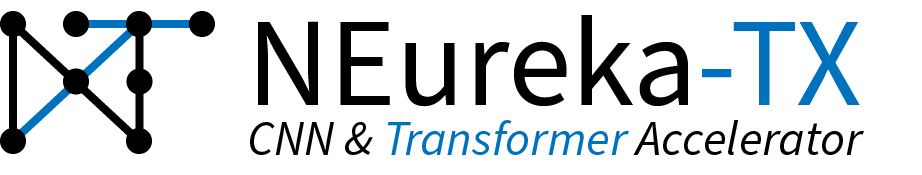

<p align="center">
  
</p>

# NEureka-TX Hub

<!-- [](LICENSE) -->

This is the entry point for the **NEureka-TX** accelerator project.  
It collects all related repositories as Git submodules and provides a single checkout for the whole stack.

## Repositories

This hub contains the following submodules. See each repository’s README for details, build instructions, and usage.

- [**NEureka-TX**](https://github.com/lionnus/neureka-tx)  
  RTL design and test bench.
  - **neureka-tx branch**: Newest RTL changes and latest developments. Note: Will be merged to main soon.
  - **backend-implementation branch**: Proper backend implementation support with e.g. working Makefile for post-layout netlists, fixed clock gating cells, etc. However, not the fastest and newest version.

- [**i-vit**](https://github.com/lionnus/i-vit)  
  Integer transformer training and evaluation pipeline, including PwPA analysis.

- [**backend-neureka-tx**](https://github.com/lionnus/backend-neureka-tx)  
  Backend tools for lab and internal usage, for access GF22 NDA required.

- [**pulp-cluster**](https://github.com/lionnus/pulp_cluster)  
  Integration of NEureka-TX into the PULP cluster.

## Quickstart

Clone this repository with all submodules:

```bash
git clone --recurse-submodules https://github.com/lionnus/neureka-tx-hub.git
cd neureka-hub
````

If you already cloned without submodules, fetch them with:

```bash
git submodule update --init --recursive
```

Update all submodules to their latest `main`:

```bash
git submodule update --remote --merge
```

## License

<!-- This project is licensed under the terms of the [LICENSE](LICENSE) file. -->